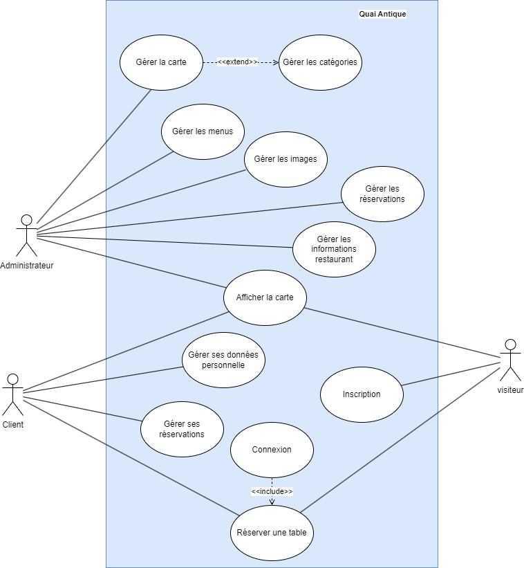
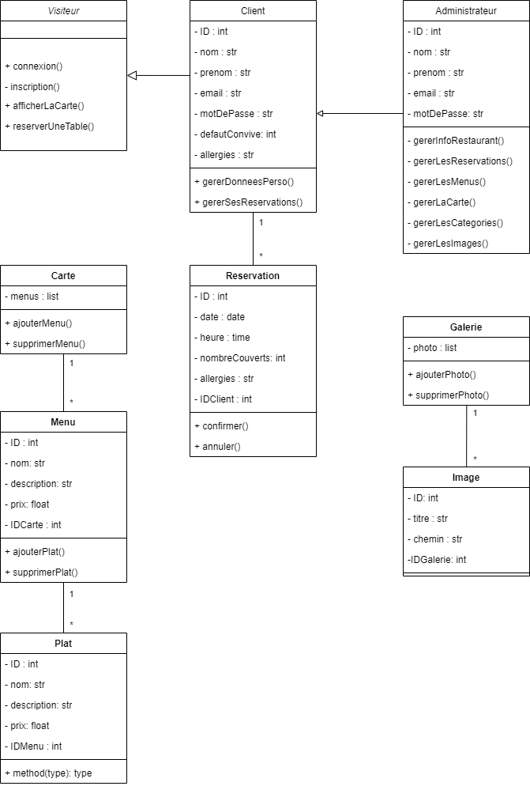

# Quai Antique

## Description

Site web pour le restaurant gastronomique "Le Quai Antique" à Chambéry.

## Fonctionnalités

- Voir le menu
- Réserver une table en ligne
- Voir des photos des plats
- Informations sur le restaurant et le chef
- Gérer ses réservations (voir, modifier, supprimer)
- Se connecter et s'inscrire
- Modifier ses données personnelles

## Technologies

- **Front-end** : HTML, CSS, JavaScript
- **Back-end** : PHP
- **Base de données** : MySQL

## Auteurs

- Mathieu Balayé

## Diagramme de Cas d'Utilisation

## Diagramme de Classes

